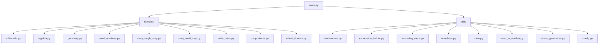

# Architecture

- `math_dataset_generator/main.py`:
  - CLI entry point
  - Dispatches to domains
- `math_dataset_generator/domains/`:
  - Each file implements a domain-specific generator
- `math_dataset_generator/utils/`:
  - Shared utilities for randomization, expressions, reasoning, noise, config
- `tests/`:
  - Unit tests for core utilities and domains
